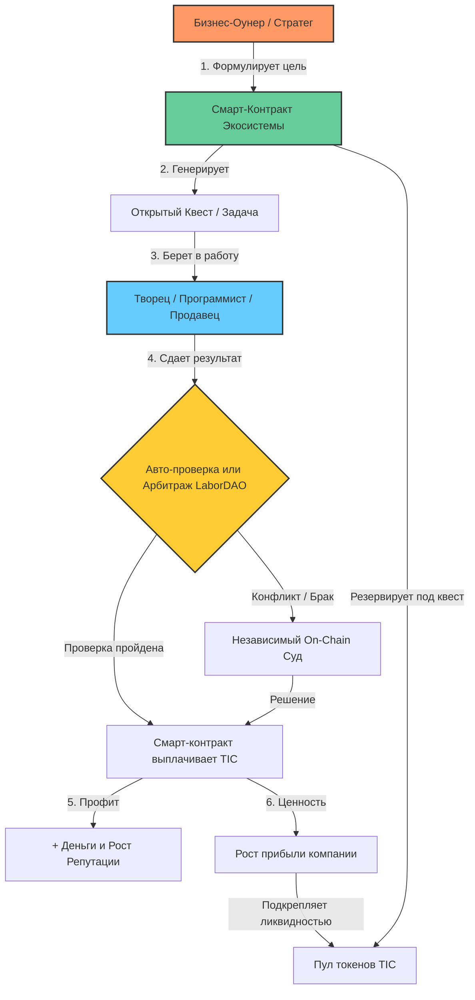

# WhitePaper_RU.md

## Corporate Social (Редакция 2026): Горизонтальная модель токенизации и эффективности труда

Настоящий документ описывает архитектуру децентрализованной экосистемы, которая объединяет жесткий инженерный подход Илона Маска к устранению бюрократии и справедливую блокчейн-систему распределения прибыли через цифровые профсоюзы (LaborDAO).

---

### 1. Проблема традиционного капитализма и мидл-менеджмента

В классических моделях бизнеса (особенно в сферах IT и продаж) между «Творцом» (программистом, продавцом, инженером) и «Собственником» выстраивается глухая стена из мидл-менеджеров, координаторов и супервайзеров. 
*   **Искажение информации:** Решения принимаются медленно, идеи творцов гибнут на этапе согласований.
*   **Выгорание и текучка:** Линейный персонал чувствует себя отчужденным от конечной прибыли, работая за сухой фиксированный оклад.
*   **Эмоциональный фактор:** В жестких плоских структурах (как у Маска) отсутствие защиты приводит к экстремальному выгоранию людей.

*Подробнее об исходной системе эффективности читайте в файле [management.md](management.md).*

---

### 2. Суть решения: Модель Гипер-Плоской Синергии

Мы предлагаем заменить человеческую прослойку контролеров прозрачными алгоритмами смарт-контрактов и децентрализованным профсоюзом нового типа — **LaborDAO**. 

#### А. Внутренние токены TIC (Tokenized Incentive Compensation)
Вместо размытия реальных юридических долей компании (что невозможно для непубличного малого и среднего бизнеса), организация выпускает внутренние токены **TIC**, привязанные к чистой «белой» прибыли. 
*   Собственник сохраняет **100% контроля** над уставным капиталом.
*   Творцы получают токены за конкретные измеримые результаты (закрытый код, перевыполнение плана продаж, оптимизация процессов).

#### Б. Геймификация и On-Chain Квесты
Задачи распределяются не через приказы начальников, а через систему открытых корпоративных квестов. Выполнение квеста автоматически начисляет исполнителю токены TIC и повышает его **Репутационный скоринг (Reputation Score)**.

#### В. Цифровой профсоюз (LaborDAO) и Смарт-Арбитраж
LaborDAO — это автоматизированный щит для сотрудника. Взаимоотношения между владельцем и создателями ценности регулируются смарт-контрактами. Если KPI выполнен — робот выплачивает бонус мгновенно. Любые споры решаются через беспристрастный on-chain суд (например, Kleros), исключая самодурство руководства.

*Полный разбор синергетического эффекта описан в файле [whatif.md](whatif.md).*

---

### 3. Экономические и Социальные Преимущества

1.  **Умножение прибыли (0% Overhead):** Расходы на содержание административного аппарата сокращаются до нуля. Все высвободившиеся ресурсы направляются на вознаграждение создателей продукта и развитие бизнеса.
2.  **Абсолютное удержание талантов:** Высокая репутация в LaborDAO дает сотрудникам множители к доходу и право голоса при закупке софта или изменении графиков работы. Творец защищен и мотивирован как полноценный партнер.
3.  **Нефинансовая мотивация:** Использование уровней, цифровых бейджей и репутационных лиг позволяет снизить кассовый разрыв (cash burn), заменяя часть материальных выплат ликвидными цифровыми активами внутри экосистемы.

---

### 4. Карта процессов экосистемы (Workflow Diagram)

Ниже представлена интерактивная схема, демонстрирующая, как идея или задача проходит путь от собственника до реализации творцом и распределения прибыли, полностью минуя менеджеров:

