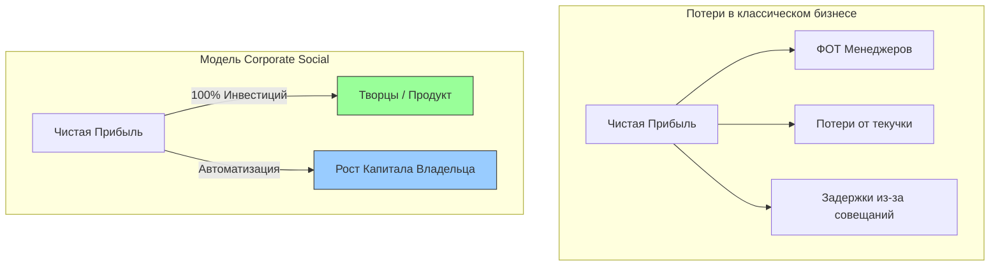

# why.md / Бизнес-выгода для Владельца (Owner's ROI)

This document details the precise financial, operational, and strategic benefits a business owner receives by implementing the Corporate Social ecosystem.

---

## 🇷🇺 ЧАСТЬ 1: Почему это выгодно Владельцу Бизнеса?

Внедрение модели Corporate Social — это не благотворительность, а прагматичный расчет, направленный на кратное увеличение чистой прибыли компании за счет устранения скрытых корпоративных потерь.

### 1. Прямая финансовая выгода (Сокращение издержек)
*   **0% расходов на мидл-менеджмент:** В классическом бизнесе до 30-40% фонда оплаты труда (ФОТ) уходит на менеджеров, супервайзеров и координаторов. В нашей модели их функции (контроль, постановка задач, отчетность) бесплатно выполняет смарт-контракт.
*   **Снижение кассового разрыва (Cash Burn):** Использование нефинансовой мотивации (ранги, репутация, цифровые SBT-сертификаты) позволяет снизить базовую фиксированную часть выплат, перенаправляя реальные деньги (токены TIC) только за фактически сданный и верифицированный результат.

### 2. Операционная скорость (По методу Илона Маска)
*   **Уничтожение испорченного телефона:** Идея собственника попадает к исполнителю-Творцу напрямую через On-Chain Квест. Больше нет совещаний, согласований и искажения смыслов менеджерами. Скорость запуска новых фич (в IT) или гипотез (в Продажах) вырастает в 3–5 раз.
*   **Автоматическая приемка:** Благодаря жесткому протоколу "Definition of Done" и слепому рецензированию Валидаторами, собственник полностью освобожден от микроменеджмента и споров "кто прав, кто виноват".

### 3. Безопасность и Контроль капитала
*   **Защита от рейдерства и размытия:** Токены TIC распределяют *прибыль*, но не дают права на владение долями в уставном капитале (ООО/АО). Владелец остается 100% единоличным хозяином компании.
*   **Абсолютная лояльность звездных сотрудников:** Топовые разработчики и продавцы не уходят к конкурентам, так как их накопленная Репутация и пассивный доход от стейкинга TIC жестко привязывают их экономическое благополучие к успеху вашего бизнеса.

---

## 🇺🇸 PART 2: Strategic Advantages for the Business Owner

Implementing Corporate Social is a strategic move designed to maximize net profit by eliminating internal corporate friction.

### 1. Direct Financial ROI
*   **Zero Middle-Management Overhead:** Up to 40% of traditional payroll is wasted on overseers and reporting meetings. Smart contracts automate task-tracking and milestone validation for free.
*   **Reduced Cash Burn:** Non-financial gamification loops (Reputation Tiers, Soulbound Badges) allow the firm to minimize fixed cash salaries, routing financial capital (TIC tokens) strictly to verified outcomes.

### 2. Hyper-Velocity Execution (The Musk Effect)
*   **Elimination of Corporate Silos:** Strategic vision translates into On-Chain Quests instantly. No middle-tier filtering, no endless sync-meetings. The execution cycle from idea to deployment scales rapidly.
*   **Autonomous Micro-Management:** The combination of strict deterministic criteria and blind peer-validation completely frees the Owner's calendar from daily fire-fighting and interpersonal drama.

### 3. Absolute Asset Protection
*   **Equity Preservation:** TIC tokens grant access to *cash flow streams*, not voting equity shares. The Owner retains 100% legal corporate control.
*   **Talent Lock-In:** High-performing "Creators" become economically anchored to the firm. Their on-chain Reputation and staking yields grow alongside your corporate revenue, eliminating employee turnover.

---

## 📊 Сравнительный анализ эффективности / Efficiency Matrix

